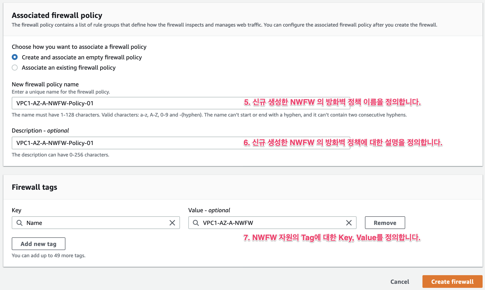

# Network Firewall 기본 구성

## 구성  아키텍쳐 소개

![\[Network Firewall &#xAE30;&#xBCF8; &#xAD6C;&#xC131; &#xC544;&#xD0A4;&#xD14D;&#xCCD0;\]](../.gitbook/assets/image%20%2810%29.png)

## Cloudformation 배포

### 1.구성 목표. 

먼저 아래의 Cloudformation을 배포합니다. Cloudformation 구성을 배포하게 되면 아래와 같은 구성이 완료됩니다.

![\[Cloudformation &#xAE30;&#xBC18;&#xC758; &#xBC30;&#xD3EC; &#xC544;&#xD0A4;&#xD14D;&#xCCD0;\]](../.gitbook/assets/image%20%286%29.png)

### 2.Cloudformation 생성. 

## Network Firewall 기본 구성. 

### 1.Network Firewall 및 Policy 생성.

**`Service - VPC - AWS Network Firewall - Firewall - Create`**

먼저 Firewall을 생성하고, Firewall Policy 생성하여 연결합니다. 기존에 Firewall Policy가 있다면 생성한 Firewall에 연결할 수 있습니다.

1. **Name** : 방화벽 이름을 정의합니다. 
2. **Description\(Optional\)** : 방화벽에 대한 설명을 정의합니다.
3. **VPC** : 생성한 VPC를 선택합니다. \(eg. VPC1\)
4. **Firewall subnets - Availability Zone** : AZ Zone을 선택합니다. \(eg. us-west-2a\) **Firewall subnets - Subnet** : 생성한 방화벽용 Subnet을 선택합니다. \(eg. VPC1-FWSubnet1\)
5. **New Firewall policy name :** 신규 생성한 NWFW의 방화벽 정책이름을 정의합니다.
6. **Description\(Optional\)** : 방화벽 정에 대한 설명을 정의합니다.   
7. **Firewall Tag :** Firewall 자원에 대한 Tag를 정의합니다.

### 2.Network Firewall 확인. 

방화벽을 생성하고 나면, **`provisoning`** 상태가 진행되며 완료까지 5분 내외가 소요됩니다.

정상적으로 설치되면 아래 그림처럼 **`Status:Ready`** 상태로 변경됩니다.

생성한 Firewall을 선택하고 Firewall details 를 선택하면, 해당 서브넷에 Endpoint가 정상적으로 생성된 것을 확인 할 수 있습니다.

**`Service-VPC-Virtual Private Cloud-Endpoint`** 메뉴에서 Firewall Endpoint를 확인 할 수 있습니다.


**Endpoint 메뉴에서 특이점을 발견할 수 있습니다. Endpoint type이 GatewayLoadBalancer 라는 것입니다. 이것은 Firewall Endpoint가 별도로 생성되지 않고, GatewayLoadBalancer를 그대로 사용한다는 것입니다. 즉 동작방식이 GatewayLoadBalancer를 이용한다는 것을 알 수 있습니다.**


## Route Table 구성

### 1. VPC Ingress 라우팅 테이블 구성. 

### 2. FW Subnet 라우팅 테이블 구성. 

### 3. Protect Subnet 테이블 구성. 

## Network Firewall 상세 구성

### 1.Firewall 구성 이해

### 2.Firewall Rule의 이해와 구성

## Cloudwatch Monitoring

